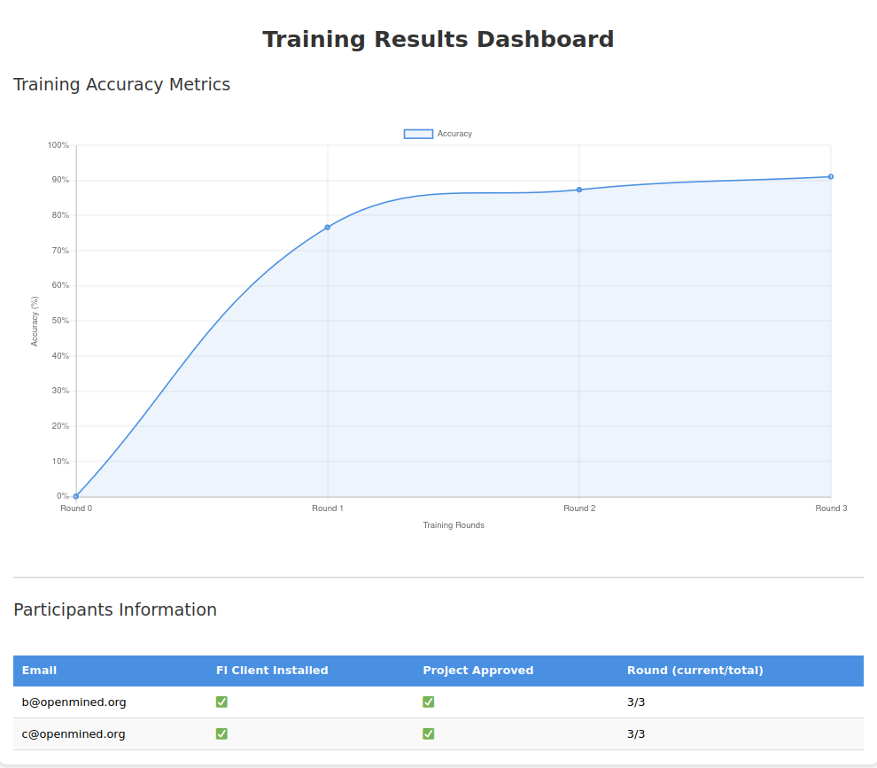

# FL Aggregator

## Usage
**1. Install the app**
```
syftbox app install OpenMined/tutorial-apps --branch fl_aggregator
```

**2. Agree on who will aggregate and who will participate**
In this example, we'll have
- Aggregator: user1@openmined.org
- Participants: user2@openmined.org and user3@openmined.org

NOTE:
- Aggregator must decide and implement the model architecture, in this example it's implemented in `model_arch.py`
- Aggregator will also provide a seed model weights which will be fine-tuned by each participant.

**3. Setup the FL config**

Based on the above, we create/edit `fl_config.json` to configure our federated learning flow

```json
{
    "project_name": "MNIST_FL",
    "aggregator": "user1@openmined.org",
    "participants": ["user2@openmined.org","user3@openmined.org"],
    "rounds": 3,
    "model_arch": "model_arch.py",
    "model_weight": "global_model_weight.pt",
    "epoch": 10,
    "learning_rate": 0.1
}
```

**4. Kickstart FL**

To start the FL training, we must copy the following files in `datasites/<aggregator_email>/app_pipelines/fl_aggregator/launch` directory
- `fl_config.json`
- `global_model_weight.pt`
- `model_arch.py`

If this directory isn't available, either run the syftbox client with fl_aggregator app installed OR create it manually.


## Post-kickoff

- Aggregator will wait for all participants to apps_piplines/fl_client
  - Once available, aggreator will copy these seed files (`fl_config.json`, `model_arch.py`) to each participants apps_piplines/fl_client
- Once all clients have approved, the FL rounds kick start
  - Sending the model
  - Client training on that
  - Client saving the model at in aggregator's pipeline

## Development

1. The aggregator install the aggregator app with `syftbox app install ./fl_aggregator --config <path_to_config.json>` where `<path_to_config.json>` points to the client's `config.json` (no the app's `config.json`)
2. Once the app is installed, the `launch` folder is created in `apps_pipeline/fl_aggregator/` together with other folders (`running`, and `done`)
3. Inside `launch`, there are 3 files: `config.json`, `model_arch.py`, `global_model_weights.pt` that the aggregator have to put in the `launch` folder
4. Once the files are in the `launch` folder, the app will create a project with the name specified in the `config.json` file inside the `running` folder, e.g. `my_cool_fl_project`
5. Inside the `my_cool_fl_project` folder, the app will create a folder for each participant where participants' models for each round are collected. Each participant folder will have a `syft_perm` file that contains the permissions to who can read / write its models
5. Then the `fl_aggregator` creates a request to the participants to join the FL flow
6. 

```
app_pipelines
└── fl_server
    ├── launch
    │   ├── config.json
    │   ├── model_arch.py
    │   ├── global_model_weights.py
    └── running
        └── my_cool_fl_proj
            ├── fl_clients 
            │   ├── a@openmined.org
            │   ├── b@openmined.org
            │   ├── c@openmined.org
            ├── agg_weights  # to store aggregator's weights for each round
            ├── config.json  # moved from the launch folder after the app start
            ├── global_model_weights.pt
            ├── model_arch.py  # moved from the launch folder
            └── state.json
    └── done
        └── my_cool_fl_proj
            └── aggregated_model_weights.pt
```


## Running in dev mode
1. First launch a server `just rs` and 3 clients (`just rc a`. `just rc b`. `just rc c`) where `a` is the fl aggregator, `b` and `c` are fl clients
2. Clone the repo `https://github.com/OpenMined/tutorial-apps` and install the `fl_aggregator` app on `a`: `syftbox app install tutorial-apps/fl_aggregator/ --config_path .clients/a@openmined.org/config.json`
3. Install `fl_client` app on `b` and `c`: `syftbox app install tutorial-apps/fl_client/ --config_path .clients/b@openmined.org/config.json` and `syftbox app install tutorial-apps/fl_client/ --config_path .clients/c@openmined.org/config.json`. Note that first time running will be slow due to package installation (e.g. `torch`)
4. FL aggregator launching the project: by copying all files inside `.clients/a@openmined.org/apps/fl_aggregator/samples/` into `.clients/a@openmined.org/datasites/a@openmined.org/app_pipelines/fl_aggregator/launch`
5. FL clients checking FL project requests: In `b` and `c` view, check if the aggregator has sent the request by checking if the folder `app_pipelines/fl_client/request`  has any content (e.g. `.clients/b@openmined.org/datasites/b@openmined.org/app_pipelines/fl_client/request/my_cool_fl_proj` for `b`)
6. FL clients accepting FL project request: `b` and `c` copies the `my_cool_fl_proj` folder in `request` into the `running` folder inside `app_pipelines/fl_client/`, e.g. `app_pipelines/fl_client/running/my_cool_fl_proj`
7. FL clients prepare data for local training: `b` and `c` prepares the data to train the local model by copying the `.pt` MNIST data files inside the folder `apps/fl_client/mnist_samples` into `private/` folder e.g. `.clients/b@openmined.org/datasites/b@openmined.org/private` for `b`. 
8. Once both `b` and `c` prepare the data, the training and aggregation will begin. Check out `http://localhost:5001/datasites/a@openmined.org/fl/my_cool_fl_proj/` to see the progress, which should look something like below 